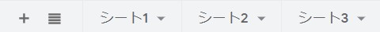

# Google-Spreadsheet-to-json
### Spreadsheet IDとは
例
> https://docs.google.com/spreadsheets/d/SpreadsheetID/edit#gid=0
 
例のSpreadsheetIDの部分がSpreadsheet IDです
  

### シート番号とは
例
> 
 

例では右から
| 1 | 2 |
|:-:|:-:|
| シート名 | シート番号 |
| シート1 | 0 |
| シート2 | 1 |
| シート3 | 2 |
